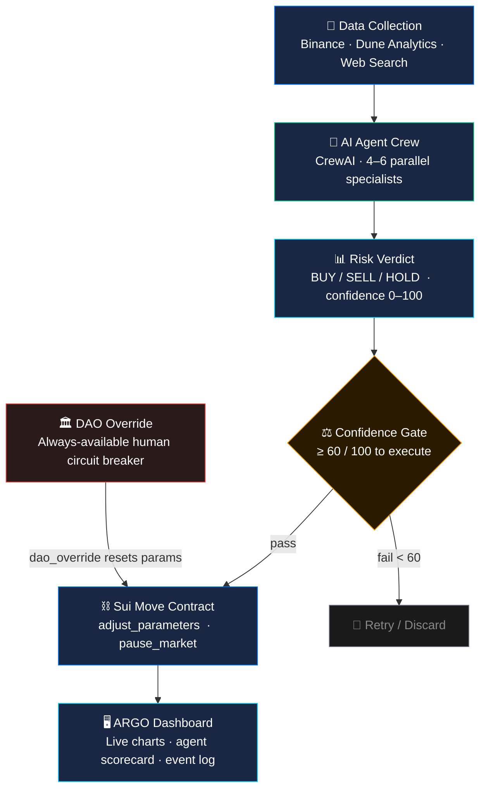

<div align="center">
  
  <h1>ARGO</h1>
  <p><strong>Autonomous Risk Guardian Operator</strong></p>

  <p>
    
    
    
    
    
    
  </p>

  <p><em>A multi-agent AI crew that watches the market, calculates risk, and autonomously adjusts on-chain DeFi parameters — all within a single confidence-gated loop on Sui.</em></p>
</div>

---

## The Concept

ARGO takes its name from the legendary Greek ship that carried Jason and the Argonauts through impossible seas. Where the mythological Argo was crewed by heroes with different skills, **ARGO the system is crewed by AI specialists** — each analysing a different facet of the crypto market in parallel, then synthesising their findings into a single, actionable verdict.

The key innovation is **the closed loop**. Most AI trading tools advise but don't act. ARGO advises *and* acts — it holds cryptographic keys, submits signed Sui transactions, and has every parameter change permanently recorded on-chain. Every decision is transparent, auditable, and always reversible by a human DAO.

> Think of it as an on-call risk manager that never sleeps, never panics, and has a mathematically enforced minimum confidence threshold before it's allowed to touch anything.

---

## The Problem

DeFi protocols run on **static risk parameters**. During a flash crash or black-swan event, those parameters become dangerously stale within seconds. A 10% de-peg that should trigger a market pause instead silently drains liquidity while on-call engineers scramble to react.

**ARGO closes that loop autonomously.**

---

## High-Level System Overview



---

## Module Breakdown

ARGO is composed of five distinct layers that form the autonomous loop:

### Module 1 — Data Layer

Feeds raw intelligence into the agents. Each source targets a different signal:

| Source | What it provides | Fidelity |
| --- | --- | --- |
| **Binance WebSocket** | Live OHLCV, 15m candles, 24h stats | LOW + HIGH |
| **Web search + scrape** | News headlines, sentiment, social signals | LOW + HIGH |
| **Dune Analytics** | On-chain DEX volumes, wallet flows, TVL | HIGH only |

### Module 2 — AI Crew

A `CrewAI` pipeline of specialist agents. In LOW fidelity, 2 tasks run sequentially. In HIGH fidelity, tasks 1–4 run **in parallel** and are synthesised by the Risk Synthesiser before the Portfolio Manager issues a final verdict.

```text
LOW  (4 agents)          HIGH  (6 agents)
─────────────────        ──────────────────────────────────
Technical Analyst   ─┐   Technical Analyst ─┐
Market Analyser     ─┤   On-chain Analyst   ─┤  [parallel]
                     │   News Sentiment     ─┤
                     │   Macro Economist    ─┘
Risk Synthesiser  ◄──┘         │
                        Risk Synthesiser ◄──────────────────
Portfolio Manager ◄── (both paths converge here)
        │
        ▼
   final verdict
```

### Module 3 — Verdict Engine

The Portfolio Manager writes a structured JSON verdict. Before anything leaves the backend, two guards run:

1. **`compute_confidence`** — weighted average of agent scores (0–100). Any agent that returns 0 hard-caps the total at 40, preventing a half-analysed verdict from triggering execution.
2. **`validate_trade_parameters`** — checks that stop-loss and take-profit levels are on the correct side of the entry price (LLMs occasionally invert these).

### Module 4 — Execution Layer

An approved verdict (confidence ≥ 60) triggers a Next.js API route that builds and signs a Sui transaction using the `GuardianCap`:

- `BUY` / `HOLD` → `adjust_parameters(ltv_bps, borrow_cap, confidence, recommendation)`
- `SELL` → `pause_market(reason)` — halts borrowing immediately

The Move contract independently re-asserts the same guard (`confidence >= 60`, `ltv_bps <= 9000`) on-chain. Even if the off-chain code is compromised, the contract will reject an invalid call.

### Module 5 — Transparency & Override

Every action emits an on-chain event (`ParametersAdjusted`, `MarketPaused`, `MarketResumed`, `DaoOverrideApplied`). The dashboard reads these directly from the Sui RPC and displays them in a live log. The `DaoCap` holder can call `dao_override` at any time to atomically reset all parameters to safe defaults and unpause — no multisig delay, one transaction.

---

## The Autonomous Loop

```text
  User clicks Analyze
        │
        ▼
  FastAPI queues a CrewAI job
        │
        ├── LOW  fidelity (free, ~$0.02)  → 4 agents, 2 sequential tasks
        └── HIGH fidelity (paid, ~$0.30)  → 6 agents, 4 parallel tasks
        │
        ▼
  Agents produce a signed verdict  {BUY | SELL | HOLD, confidence 0–100}
        │
        ▼ confidence ≥ 60 AND approved = true
        │
  Next.js API signs + submits a Sui transaction
        │
        ├── BUY  / HOLD → adjust_parameters(ltv_bps, borrow_cap)
        └── SELL        → pause_market(reason)
        │
        ▼
  On-chain event emitted → live dashboard updates
```

---

## Agent Architecture

### LOW fidelity — free APIs only (~$0.01–0.03 / run)

```python
# main.py — build_low_fidelity_crew()
def build_low_fidelity_crew(coin: str) -> Crew:
    technical_analysis_expert = agents.technical_analysis_expert_low(fidelity="LOW")
    crypto_market_analyzer    = agents.crypto_market_analyzer_low(fidelity="LOW")
    risk_assessment_expert    = agents.risk_assessment_expert_low(fidelity="LOW")
    crypto_portfolio_manager  = agents.crypto_portfolio_manager_low(fidelity="LOW")

    task1 = tasks.technical_analysis_task(agent=technical_analysis_expert, coin=coin)
    task2 = tasks.market_scrape_task(agent=crypto_market_analyzer, coin=coin)
    task5 = tasks.risk_assessment_task(agent=risk_assessment_expert, coin=coin,
                                        context=[task1, task2])
    task6 = tasks.final_review_task_low(agent=crypto_portfolio_manager, coin=coin,
                                         context=[task5])
    return Crew(agents=[...], tasks=[task1, task2, task5, task6], verbose=False)
```

### HIGH fidelity — full pipeline (~$0.15–0.40 / run)

```python
# main.py — build_high_fidelity_crew()
# tasks 1–4 run in parallel, task5 synthesises them all
task1 = tasks.news_and_sentiment_task(agent=crypto_news_analyst,       coin=coin)
task2 = tasks.onchain_analysis_task(agent=onchain_data_analyst,        coin=coin)
task3 = tasks.technical_analysis_task(agent=technical_analysis_expert, coin=coin)
task4 = tasks.macro_analysis_task(agent=market_context_expert,         coin=coin)
task5 = tasks.risk_assessment_task(agent=risk_assessment_expert,       coin=coin,
                                    context=[task1, task2, task3, task4])
task6 = tasks.final_review_task(agent=crypto_portfolio_manager,        coin=coin,
                                 context=[task5])
```

### Confidence formula — mirrors the on-chain guard exactly

```python
# main.py — compute_confidence()
def compute_confidence(scores: dict, fidelity: str = "HIGH") -> int:
    if fidelity == "LOW":
        weights = {"technical": 0.60, "market": 0.25, "risk": 0.15}
    else:
        weights = {"news": 0.15, "onchain": 0.25, "technical": 0.30,
                   "macro": 0.15, "risk": 0.15}

    # any zero score hard-caps confidence at 40 (incomplete analysis)
    if 0 in [scores.get(k, {}).get("score", 0) for k in weights]:
        cap = 40
    else:
        cap = 100

    total = sum(scores.get(k, {"score": 0})["score"] * w * 10
                for k, w in weights.items())
    return min(int(total), cap)
```

---

## Verdict Schema

What the crew returns after every run:

```json
{
  "approved": true,
  "overall_confidence": 72,
  "final_recommendation": "BUY",
  "recommendation_confidence": "MEDIUM",
  "scores": {
    "technical": { "score": 8, "reason": "RSI oversold, MACD crossover forming" },
    "market":    { "score": 6, "reason": "Moderate sell pressure, support holding" },
    "risk":      { "score": 7, "reason": "Volatility within acceptable range" }
  },
  "trade_parameters": {
    "entry_range":   "$0.68–$0.72",
    "stop_loss":     "$0.62",
    "take_profit_1": "$0.82",
    "take_profit_2": "$0.95",
    "position_size": { "conservative": "2%", "medium": "4%", "aggressive": "7%" }
  },
  "invalidation_conditions": ["Close below $0.62", "BTC drops > 8% in 4h"],
  "reason": "Technical setup favours accumulation at current levels..."
}
```

---

## On-Chain Execution

The approved verdict is translated directly into a Sui Move transaction — **no human in the loop**:

```typescript
// nextui-dashboard/pages/api/execute.ts
const tx = new Transaction()

if (recommendation === 'SELL') {
  // de-peg detected → halt the market
  tx.moveCall({
    target: `${packageId}::guardian::pause_market`,
    arguments: [
      tx.object(guardianCapId),
      tx.object(riskParamsId),
      tx.pure.vector('u8', Array.from(encoder.encode(`de_peg_detected:${coin}`))),
    ],
  })
} else {
  // BUY / HOLD → adjust LTV derived from confidence score
  const ltv = recommendation === 'BUY' && confidence >= 80 ? 8000 : 7500
  tx.moveCall({
    target: `${packageId}::guardian::adjust_parameters`,
    arguments: [
      tx.object(guardianCapId),
      tx.object(riskParamsId),
      tx.pure.u64(ltv),
      tx.pure.u64(1_000_000),
      tx.pure.u64(confidence),
      tx.pure.vector('u8', Array.from(encoder.encode(recommendation))),
    ],
  })
}

const result = await suiClient.signAndExecuteTransaction({ signer: keypair, transaction: tx })
```

### The Move contract that enforces the guards

```move
// contracts/sources/guardian.move
public fun adjust_parameters(
    _cap: &GuardianCap,
    params: &mut RiskParameters,
    ltv_bps: u64,
    borrow_cap: u64,
    confidence: u64,
    recommendation: vector<u8>,
    _ctx: &mut TxContext,
) {
    assert!(!params.paused,     EMarketPaused);   // can't adjust while halted
    assert!(confidence >= 60,   ELowConfidence);  // minimum 60/100 required
    assert!(ltv_bps    <= 9000, ELtvTooHigh);     // hard cap at 90% LTV

    params.ltv_bps      = ltv_bps;
    params.borrow_cap   = borrow_cap;
    params.action_count = params.action_count + 1;

    event::emit(ParametersAdjusted {
        ltv_bps, borrow_cap, confidence,
        recommendation, action_count: params.action_count,
    });
}
```

---

## Smart Contract

| Field | Value |
| --- | --- |
| Network | Sui Testnet |
| Package ID | `0x5359aea4212626259a4b36d25517074c72a729f3af7f09bac501fdd53be20955` |
| RiskParameters object | `0x6a76b6e605a474cc1a3a94901af39f78f58e1c972c49be444f1181400d74f544` |
| Module | `risk_guardian::guardian` |
| On-chain actions | 9 (visible in the live event log) |

---

## Quick Start

**Prerequisites:** Python 3.10+, Node.js 18+, OpenAI key, Serper key, Dune key (HIGH only)

```bash
# 1. Clone
git clone https://github.com/pkhaan/Autonomous-Risk-Guardian.git
cd Autonomous-Risk-Guardian

# 2. Backend
pip install -r requirements.txt
cp .env.example .env                 # fill in API keys
uvicorn server:app --port 8000 --reload

# 3. Frontend (new terminal)
cd nextui-dashboard
npm install
cp .env.example .env.local           # fill in Sui object IDs + private key
npm run dev                          # → http://localhost:3000
```

---

## Project Structure

```text
Autonomous-Risk-Guardian/
├── server.py                  # FastAPI — /analyze /approve /reject /result
├── main.py                    # CrewAI crew builder + compute_confidence
├── agents.py                  # Agent definitions (LOW + HIGH fidelity)
├── tasks.py                   # Task definitions
├── tools/
│   ├── Binance_price_data_tool.py       # Live OHLCV (free)
│   ├── SearchAIO.py                     # Web search + scrape
│   └── Dune_analytics_onchain_tool.py   # On-chain data (HIGH only)
├── contracts/
│   └── sources/guardian.move            # Sui Move policy contract
└── nextui-dashboard/                    # Next.js 14 frontend
    ├── pages/api/
    │   ├── execute.ts                   # Signs + submits Sui transactions
    │   ├── dao-override.ts              # DAO reset transaction
    │   ├── onchain-log.ts               # Live event + RiskParams reader
    │   └── klines.ts                    # Binance 15m candle proxy
    └── components/arg/
        ├── AgentAnalyzer.tsx            # Analysis trigger + fidelity selector
        ├── CryptoSparklineWidget.tsx    # BTC/SUI live area charts
        ├── RiskScore.tsx                # Confidence gauge
        ├── OnChainLog.tsx               # Live Sui event log
        └── TradeParameters.tsx          # Verdict + trade parameters
```

---

## DAO Override

At any time, the holder of `DaoCap` can reset all parameters to safe defaults and unpause:

```move
// contracts/sources/guardian.move
public fun dao_override(
    _cap: &DaoCap,
    params: &mut RiskParameters,
    action: vector<u8>,
    ctx: &mut TxContext,
) {
    params.paused     = false;
    params.ltv_bps    = 7500;        // reset to 75%
    params.borrow_cap = 1_000_000;
    params.action_count = params.action_count + 1;

    event::emit(DaoOverrideApplied {
        action, by: tx_context::sender(ctx),
        action_count: params.action_count,
    });
}
```

---

<div align="center">
  <sub>Built with CrewAI · FastAPI · Next.js · Sui Move &nbsp;|&nbsp; Sui Overflow 2026</sub>
</div>
